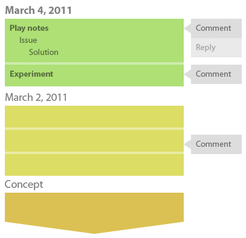

## Documentação e GDDs

Apresentação de abordagens:

- [Short Game Design Document](http://www.sbgames.org/sbgames2013/proceedings/artedesign/15-dt-paper_SGDD.pdf)
- [Simple Game Design Document](http://pixelatto.com/simple-gdd/)
- [One-Page Design](http://stonetronix.com/gdc-2010/OnePageDesigns.ppt)
- [Game Design Canvas](http://www.buddroyce.com/wp-content/uploads/2013/03/GameDesignCanvas_ShareMe_Fillable.pdf)
- [Game Design Log](http://www.lostgarden.com/2011/05/game-design-logs.html)

*Diagrama de um *game design log*.*