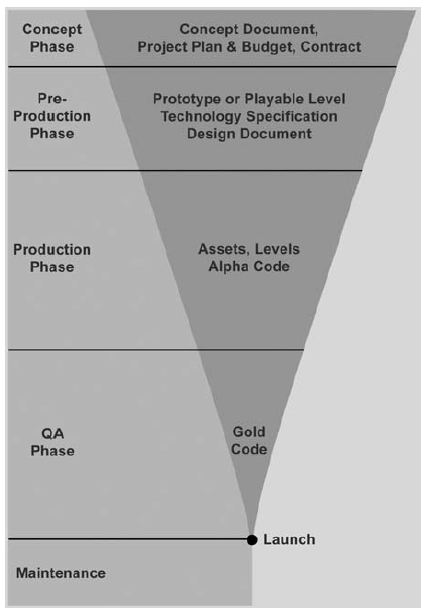

## Equipes de desenvolvimento

Uma equipe de desenvolvimento de jogos é multidisciplinar, já que jogos são uma forma de expressão marcada pela convergência de diversos meios. Cada função tem uma série de responsabilidades no processo de desenvolvimento.

O fato de existir uma diversidade de funções nem sempre implica em que uma pessoa só se ocupe de uma única função ou até que se ocupe da mesma função durante todo o projeto. É importante levar em consideração as funções de cada integrante em cada etapa do processo.

 

*Tamanho de equipes em diferentes plataformas.*

### Responsabilidades por função

Game designer | Produtor | Programador 
----|-----|-----
Brainstorm, prototipagem, playtests, GDDs, comunicar a visão do jogo, defender os jogadores | Comunicação entre editora e estúdio, gerenciar calendário e orçamento, distribuir recursos, motivar e organizar equipe | Especificações técnicas, implementar o jogo, criar ferramentas para equipe, documentar código, contribuir com controle de qualidade

Artista visual | Técnicos de QA | Designer de som
---|---|--- 
Produzir conteúdos visuais, conceitos de arte, personagens, objetos, interfaces, animações | Criar e executar plano de testes, documentar comportamentos inesperados e indesejados, categorizar e priorizar bugs e erros, checar crreções | Criar e executar uma identidade sonora para o jogo, produzir música e efeitos sonoros, gravar foleys, mixar som, colaborar com implementação do som

### Perfil de equipe

 

*Perfis de equipe em diferentes plataformas.*

## Etapas de desenvolvimento

É importante analisar os diferentes momentos da criação de um jogo para melhor compreender suas necessidades e possibilidades. Esse conhecimento também ajuda a não repetir erros de outras equipes ou projetos, assim como aproveitar boas práticas. É comum que cada uma dessas etapas esteja associada a *milestones*, ou entregas / marcos, que devem ser conhecidas também.

A evolução de um projeto de jogo é marcada pela diminuição gradual da flexibilidade de mudar o jogo. No início, aspectos fundamentais podem ser alterados substancialmente sem maiores prejuízos, mas com o passar do tempo, cada alteração ganha um peso maior. Isso é natural do processo criativo e deve ser considerada durante todo o projeto.

### Conceito / Ideação

Nessa etapa inicial, o jogo está abstrato e indefinido. É a etapa com maior flexibilidade e incertezas. As áreas de foco abaixo servem para ajudar a navegar essa etapa. É importante vê-las de forma interligada, já que mudanças em um desses aspectos tem consequências diretas nos outros.

#### A equipe

Os diferentes tipos de pessoas interessados em seu jogo, sejam investidores, contratantes ou seu público, vão querer saber mais sobre sua equipe de trabalho. Alguns aspectos importantes a serem considerados nessa etapa:

- A capacidade da equipe de entregar o prometido.
- Experiência de trabalho conjunto.
- Clareza de atribuições e responsabilidades.
- Experiências anteriores, em especial na(s) plataforma(s) em questão.

#### O plano de projeto

Para guiar a etapa de conceito e todo o desenvolvimento posterior, é necessário definir um orçamento e um calendário para o projeto. Esse trabalho de planejamento é essencial tanto para convencer interessados quanto para ajudar a definir melhor a idéia e a equipe adequadas para o projeto.

#### A idéia

Nessa etapa, a idéia inicial para o jogo é estalecida e, talvez até mais importante ainda, é comunicada a diferentes partes interessadas, seja um cliente ou  à própria equipe. É aqui que são elaborados *documentos de game design*, *pitchs* e *apresentações de projeto*.

### Pré-produção

Após a etapa inicial de ideação,  uma equipe reduzida e multi-disciplinar começa a prototipar o jogo com o objetivo de testar sua viabilidade e seu potencial. É nessa etapa que diferentes métodos e técnicas de design exploratório são utilizados, assim como ferramentas variadas para criação e experimentação de arte, som e mecânicas. É uma etapa que produz marcos como *protótipos de arte*, *primeiros jogáveis*, *protótipos analógicos*, *roteiros* e *storyboards*. Também é nessa etapa que a consolidação do design facilita a criação de documentos como o *documento de design técnico* e o *documento de game design detalhado*, com o objetivo de guiar a etapa de produção.

### Produção

É a etapa mais longa e cara. É neste momento que o projeto ganha corpo e as idéias e conceitos elaborados anteriormente são concretizados. Durante essa etapa, a equipe tende a se manter mais separada, focada em suas especialidades, seguindo da melhor maneira possível o calendário de produção estipulado anteriormente. Programadores programam e artistas produzem arte, etc. Claro, isso não significa o fim do diálogo, mas a necessidade de uma produção eficiente torna a flexibilidade menor.

Os marcos mais recorrentes nessa etapa estão listados abaixo:

- **Alfas.** Todas as principais funcionalidades e conteúdos estão no jogo. Ainda está instável e sujeito a algumas mudanças. 
- **Builds.** Diversas versões jogáveis incompletas criadas durante a produção.
- **Fatias verticais.** Versões que mostram a interação entre diferentes sistemas do jogo. O exemplo mais comum é o de fases ou níveis do jogo.
- **Fatias horizontais.** Versões focadas em demonstrar a funcionalidade completa de um determinado sistema do jogo. Um exemplo seria criar um build com todo o sistema de inventário ou o sistema multi-jogador funcional, mesmo que sem a arte final do jogo.

Durante toda a produção acontecem *playstests* com usuários para validar e refinar diferentes aspectos do jogo, mas vamos abordar essa ferramenta em mais detalhes posteriormente.

### Controle de qualidade e polimento

É uma etapa voltada para a estabilização e melhoria do que foi criado durante a etapa de produção. Erros e bugs são corrigidos e são feitos extensos testes com o usuário final. Qualquer conteúdo que esteja faltando é adicionado ao jogo. É uma etapa em que toda a equipe está envolvida e que exige organização para evitar re-trabalho e perda de eficiência. É comum criar *planilhas de estabilização e revisão* com os diferentes bugs e melhoras desejadas e estipular responsabilidades para cada área do jogo, assim como a utilização de *sistemas de versionamento e builds*, para organizar as diferentes versões testadas e revisadas. Ao final dessa etapa, o jogo estará em **beta**, com o seu conteúdo completo e pronto para uma validação final antes do lançamento.

### Lançamento e pós-produção

O jogo está pronto, validado e será lançado. Nesse momento, bugs e problemas surgem constantemente, já que jogadores são ótimos em encontrá-los. é necessário um esforço organizado de manter o jogo, corrigindo problemas e criando novos conteúdos conforme a demanda. Com a distribuição digital de jogos, essa etapa tornou-se mais elaborada, já que facilita a distribuição de novos conteúdos e consertos. Em algumas plataformas, como mobile, é comum ter que lidar com a variedade de dispositivos e com a demanda por conteúdo atualizado.

---
### Referências

FULLERTON, T. **Game design workshop: a playcentric approach to creating innovative games.** 2a ed. Boston: Elsevier Morgan Kaufmann, 2008. 