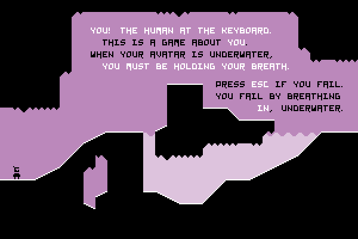

## Introdução ao game design

### Regras

> Um jogo é uma experiência criada por regras. (...) Um jogo não pode existir sem um ou mais jogadores: alguém tem que interagir com as regras para que a experiência aconteça.

> Um jogo é um diálogo entre jogadores e o jogo, e as regras que criamos são o vocabulário com o qual essa conversa acontece.

> *Anna Anthropy, Rise of the videogame zinesters.*

As regras de um jogo têm de ser capazes de se desenvolverem, como um personagem em uma história. Novas formas de interagir com uma regra e suas relações com outras regras são esse desenvolvimento. 

Temos de evitar **regras soltas**, desconectadas ou isoladas do resto do jogo. Outro aspecto importante é a necessidade de **explicar as regras ao jogador** da forma mais clara e menos intrusiva possível, e por isso podemos usar uma série de técnicas, entre elas se destaca o uso de cenas, contextos e objetos adequados.

*[Asphyx, por Droqen](http://dl.droqbox.com/asphyx/)*

#### Verbos

> Verbos são um tipo de regra; são as regras mais importantes de um jogo. Um "verbo" seria qualquer regra que dá ao jogador a liberdade de agir dentro das regras do jogo. Qualquer regra que deixa o jogador mudar o estado do jogo. Qualquer regra que permite fazer algo. (...)

> O papel do game design é criar as regras que dão forma à experiência do jogador, suas escolhas, sua performance. Regras são como nos comunicamos, e verbos são as regras que permitem ao jogador nos responder.

> *Anna Anthropy, Rise of the videogame zinesters.*

#### Objetos

São um outro tipo de regra, que define os objetos (e sujeitos) das sentenças definidas pelas regras. O objetivo é escolher objetos que permitam relações interessantes com os verbos e outros objetos do jogo. Para ficar mais concreto, olhe os exemplos abaixo:

- "Somente o **goleiro** pode agarrar a **bola** com as mãos"
- "O **nível de proteção** do personagem é a soma de todos as **partes de sua armadura** mais **efeitos mágicos**"
- "O **avestruz voador** mata o **pterodáctilo** apenas se tocá-lo diretamente no **focinho**"

<iframe width="100%" height="480" src="https://www.youtube.com/embed/iwrSyiS1YC0" frameborder="0" allowfullscreen></iframe>

*Joust no Atari 2600*

### Exercício em sala

Usando os conceitos acima, vamos, em grupos, analisar os três jogos abaixo.

- Pega-pega
- Pac-man
- Xadrez

---
### Referências

- ANTHROPY, A.; CLARK, N. **A Game Design Vocabulary: Exploring the Foundational Principles Behind Good Game Design.** 1 edition ed. Indianapolis, IN: Addison-Wesley Professional, 2014. 
