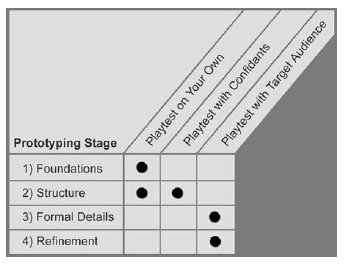

# Testando jogos

O teste de jogos (ou **playtesting**) é uma atividade central ao desenvolvimento de jogos. Agora, o que é playtesting? Existe uma certa confusão entre os diferentes tipos de teste que um jogo passa durante seu ciclo de desenvolvimento. Podemos distinguir entre algumas atividades parecidas com playtesting, mas que não cumprem o mesmo objetivo:

1. *Grupos de foco.* Testes do jogo (ou aspectos dele) com público-alvo com o objetivo de entender melhor a recepção desse público ao jogo.
2. *Testes de qualidade.* Profissionais de controle de qualidade (QA) experimentam o jogo para encontrar falhas de implementação, bugs e possíveis problemas de software.
3. *Revisão interna de design.* Quando a equipe do jogo testa para garantir que os objetivos de design buscados estão sendo alcançados.

O principal objetivo de qualquer sessão de playtesting é sempre o mesmo: **conseguir feedback de jogadores sobre a experiência de jogar o jogo.** Esse feedback deve ser documentado e utilizado em futuras revisões e discussões sobre o jogo. Esse objetivo é contemplado nas diversas etapas de desenvolvimento do jogo de formas diferentes.

### Auto-teste

Realizado pela própria equipe do jogo, de forma orgânica e informal. É quando a equipe joga os diferentes protótipos e versões, buscando sempre manter um distanciamento do que está sendo testado e feedbacks encontrados. É importante lembrar que a equipe é parcial em relação ao jogo e também que está profundamente acostumada com suas peculiaridades.

### Teste com conhecidos

Jogar o jogo com pessoas que não estão acostumadas com ele. Isso significa que essa versão do protótipo tem que estar completa o suficiente para que os jogadores tenham alguma autonomia para interpretar suas regras e jogar sem muita intervenção da equipe. É importante estar atento ao viés que pessoas próximas tem com o seu jogo, já que são amigos.

### Teste com desconhecidos

Pessoas que você não conhece de antemão são o público mais imparcial, já que não tem nenhum motivo para querer agradar você. Trazem um novo olhar sobre o jogo e devem ser tratados com respeito e cuidado, para que estejam confortáveis para jogar de forma concentrada e sem empecilhos.

## Como fazer uma sessão de playtesting

O melhor é tentar explicar o jogo o menos possível, para que o jogador tenha que entendê-lo por si só. Lembre-se: você não estará ao lado de cada jogador para explicar qualquer coisa quando o jogo for lançado.

Uma maneira de organizar a sessão é ter uma pessoa em contato com o jogador e outra num papel de observador, apenas anotando o que o participante faz. É conveniente pedir que as pessoas joguem falando em voz alta o que estão pensando e tentando fazer. Isso ajuda a ter uma ideia melhor da experiência dela jogando o jogo.

É importante resistir ao impulso de falar demais, perguntando e guiando demais a experiência do jogador. Uma forma de controlar esse impulso é criar um pequeno roteiro de teste, com o passo-a-passo para cada sessão, incluindo (em linhas gerais, não somos robôs) as falas para cada momento da sessão. Uma estrutura básica de roteiro para a sessão pode ser:

1. Introdução com explicações básicas sobre a sessão.
2. Discussão rápida para conhecer melhor o participante e sua experiência com jogos que seja relevante ao jogo testado.
3. Sessão de jogo
4. Discussão sobre a experiência do jogador (prepare as questões de antemão)

## Referências

FULLERTON, T. **Game design workshop: a playcentric approach to creating innovative games.** 2a ed. Boston: Elsevier Morgan Kaufmann, 2008.